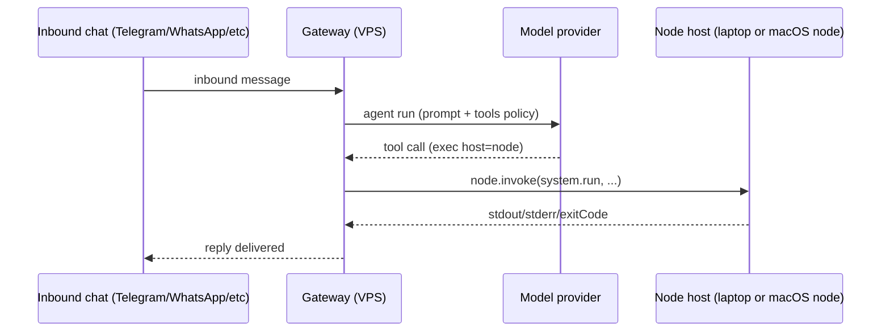
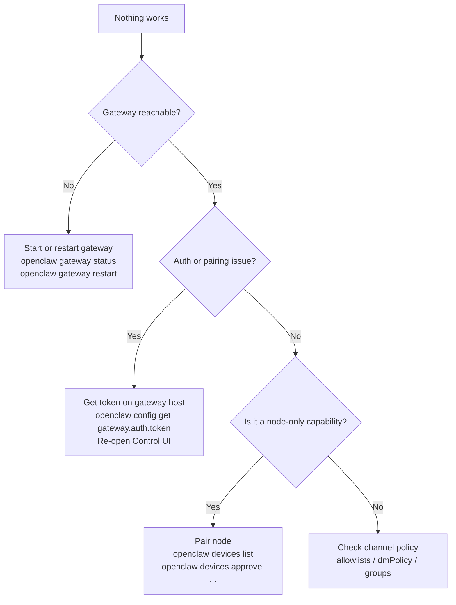

# System architecture

This page is a single, end-to-end guide to how OpenClaw works in practice when you run the Gateway on a VPS (or any always-on host).

If you only remember one thing, remember this:

- The **Gateway host** is where the system actually lives: sessions, auth profiles, channel logins, and (usually) your workspace files.
- Everything else (CLI, macOS app, browser Control UI, phones, nodes) is a **client** that connects to the Gateway over the Gateway WebSocket.

Related deep dives:

- [Gateway architecture](/concepts/architecture)
- [Network model](/gateway/network-model)
- [Remote access](/gateway/remote)
- [Multi-Agent Routing](/concepts/multi-agent)
- [Nodes](/nodes)
- [VidClaw (control center)](/tools/vidclaw)

## Terms

- **Gateway**: the long-running process that owns channel connections and the WebSocket control plane (`openclaw gateway`).
- **Gateway host**: the machine running the Gateway (your VPS, home server, Mac mini, or laptop).
- **Agent**: one isolated "brain" (workspace + per-agent auth + per-agent sessions) inside the Gateway. See [Multi-Agent Routing](/concepts/multi-agent).
- **Operator client**: CLI, Control UI, macOS app, or automation connecting with `role: operator`. See [Gateway protocol](/gateway/protocol).
- **Node**: a companion device that connects with `role: node` and exposes commands like `canvas.*`, `camera.*`, `system.run`. See [Nodes](/nodes).
- **Control UI**: the built-in browser UI served by the Gateway at `/` (default port `18789`). See [Control UI](/web/control-ui).
- **VidClaw**: a separate self-hosted dashboard that runs next to the Gateway (default `127.0.0.1:3333`). See [VidClaw](/tools/vidclaw).

## High level component map

```mermaid
flowchart LR
  subgraph VPS[Gateway host (VPS or always-on machine)]
    GW[OpenClaw Gateway\nWebSocket + HTTP\n:18789]
    STATE[(~/.openclaw\nconfig + credentials + sessions)]
    WS[(Agent workspace\n~/.openclaw/workspace-...)]
    GW --- STATE
    GW --- WS
  end

  subgraph Operator[Operator clients]
    CLI[CLI\nopenclaw ...]
    UI[Control UI\nBrowser SPA]
    MAC[macOS app\n(remote over SSH optional)]
    AUTO[Automation\nhooks/webhooks/cron]
  end

  subgraph Nodes[Nodes (role: node)]
    IOS[iOS node]
    AND[Android node]
    MACNODE[macOS node mode]
    HEAD[Headless node host]
  end

  CLI <-- WebSocket --> GW
  UI <-- WebSocket --> GW
  MAC <-- WebSocket --> GW
  AUTO <-- WebSocket --> GW

  IOS <-- WebSocket --> GW
  AND <-- WebSocket --> GW
  MACNODE <-- WebSocket --> GW
  HEAD <-- WebSocket --> GW
```

## What runs where (VPS mental model)

When you use a VPS, treat it as the "source of truth" machine:

- The Gateway runs on the VPS (or always-on host).
- Inbound messages (Telegram, WhatsApp, Discord, etc.) land on the Gateway.
- The agent loop runs on the Gateway host.
- Session transcripts and per-agent state are stored on the Gateway host.

Your laptop and phone are typically:

- operator clients (Control UI, CLI), and/or
- nodes (camera/canvas/screen/system.run) that the Gateway can call into.

## The control plane is one WebSocket protocol

OpenClaw uses a single WebSocket protocol for:

- operator control (status, chat, config, approvals)
- node transport (node capabilities and `node.invoke`)

All clients start by sending a `connect` request, declaring their role, and authenticating. See [Gateway protocol](/gateway/protocol).

### Why this matters

If you can reach the Gateway WebSocket securely, you can:

- open the Control UI
- operate the CLI remotely
- connect nodes

So remote access is mostly about safely exposing or tunneling that single port.

## Remote access patterns (VPS)

Default Gateway setup is loopback-first (`127.0.0.1:18789` on the Gateway host). You then reach it remotely using one of these patterns.

### Pattern A: SSH tunnel (universal fallback)

```bash
ssh -N -L 18789:127.0.0.1:18789 user@gateway-host
```

Then point clients at `ws://127.0.0.1:18789` and open the Control UI at `http://127.0.0.1:18789/`.

### Pattern B: Tailscale Serve (recommended for the Control UI)

Keep the Gateway loopback-only and let Tailscale proxy it with HTTPS. See [Control UI](/web/control-ui) and [Tailscale](/gateway/tailscale).

### Pattern C: Bind to tailnet or LAN

Bind the Gateway beyond loopback only when you mean it, and ensure auth is enabled. See [Remote access](/gateway/remote) and [Security](/gateway/security).

## Authentication and access boundaries

There are multiple "doors" that protect a VPS Gateway. You typically want all of them.

### Door 1: Gateway auth (token or password)

Gateway auth is enforced during the WebSocket handshake via `connect.params.auth`:

- token: `gateway.auth.token` (or `OPENCLAW_GATEWAY_TOKEN`)
- password: `gateway.auth.password`

See [Dashboard](/web/dashboard) and [Gateway configuration](/gateway/configuration).

### Door 2: Device identity and pairing

New operator devices and nodes require a one-time approval (device pairing). This prevents someone who got network access from silently controlling your Gateway.

See:

- [Control UI pairing](/web/control-ui#device-pairing-first-connection)
- [Gateway protocol: device identity](/gateway/protocol#device-identity--pairing)
- [Devices CLI](/cli/devices)

### Door 3: Channel allowlists and policies

Inbound messages are gated per channel:

- DM policy (pairing, allowlist, open, disabled)
- Group allowlists and mention requirements

See [Security](/gateway/security) and the relevant channel docs under [Channels](/channels).

### Door 4: Tool execution boundaries (sandbox, node, approvals)

Tool execution is where "chat becomes actions". OpenClaw provides multiple boundaries you can combine:

- **Sandboxing**: run certain sessions in Docker. See [Sandboxing](/gateway/sandboxing).
- **Exec approvals**: require allowlists or interactive approval for shell commands. See [Exec approvals](/tools/exec-approvals).
- **Node host**: run commands on a separate machine (your laptop) instead of the VPS. See [Nodes: remote node host](/nodes#remote-node-host-systemrun).

The diagram below shows the common "VPS Gateway + local node" setup for safe local access.



## Agents (how many, and how to think about them)

An agent is the unit of isolation inside a single Gateway process:

- separate workspace
- separate per-agent auth profiles
- separate session store and transcripts

See [Multi-Agent Routing](/concepts/multi-agent).

### Recommended defaults (most people)

1. **One agent (`main`)** for personal chat is enough when only you can DM the bot.
2. **Two agents** is a common upgrade:
   - `main`: chat, status, routing, approvals
   - `coder`: sandboxed execution for coding and automation
3. **Three agents** is a common "ops split":
   - `main`: chat surface (minimal tools)
   - `coder`: sandboxed tool execution
   - `ops`: maintenance only (disabled or tightly allowlisted most of the time)
4. **Four agents** is a common "super powers split" (recommended for hardened VPS setups):
   - `main`: chat surface (minimal tools; no host exec; no browser)
   - `coder`: sandboxed execution (tool runs happen in Docker)
   - `power`: browser + approvals-gated host exec (no file mutation tools)
   - `ops`: maintenance only (usually disabled or read-only)

If you use a dedicated `power` agent, configure `sessions_spawn` to allow `main` to target it:

```json5
{
  agents: {
    list: [{ id: "main", subagents: { allowAgents: ["power", "coder"] } }],
  },
}
```

### When you want more agents

- Multiple people share one Gateway: use one agent per person for isolation, then route via bindings.
- Multiple "personas" with different rules: one agent per persona.
- Different credentials or model choices: per-agent auth and per-agent model defaults make this clean.

### When you need separate VPSes

Usually you do not. One Gateway can host multiple agents.

Use separate hosts only when you need hard isolation boundaries that a single process + filesystem permissions cannot provide (for example, separate OS users/hosts, separate secrets, or different trust zones).

## Where data lives (important for VPS)

On the Gateway host:

- Config: `~/.openclaw/openclaw.json`
- Credentials: `~/.openclaw/credentials/`
- Per-agent auth profiles: `~/.openclaw/agents/<agentId>/agent/auth-profiles.json`
- Per-agent sessions:
  - store: `~/.openclaw/agents/<agentId>/sessions/sessions.json`
  - transcripts: `~/.openclaw/agents/<agentId>/sessions/*.jsonl`
- Workspace files (default): `~/.openclaw/workspace` (or per-agent workspaces)

Docs:

- [Agent workspace](/concepts/agent-workspace)
- [Session management](/concepts/session)

## Control UI vs VidClaw (what each is)

These are different things.

### Control UI (built-in)

- Served by the Gateway itself (default `http://127.0.0.1:18789/`).
- Talks directly to the Gateway WebSocket.
- Used for chat, config, pairing, approvals, node status, logs, channel status, and more.

Docs:

- [Control UI](/web/control-ui)
- [Dashboard](/web/dashboard)

### VidClaw (separate control center)

VidClaw is a self-hosted dashboard designed to run next to an OpenClaw Gateway:

- Typical bind: `127.0.0.1:3333`
- Typical access: SSH port-forward or a private network like Tailscale
- It can read and write workspace files and can run `openclaw` CLI commands

So yes, it is a web interface, but it is not the same as the Gateway Control UI.

How it connects:

- VidClaw reads OpenClaw state under `~/.openclaw` by default (override with `OPENCLAW_DIR`).
- VidClaw can talk to the Gateway API (default `OPENCLAW_API=http://127.0.0.1:18789`).

Docs: [VidClaw (control center)](/tools/vidclaw).

### How to open the VidClaw UI securely (VPS)

Keep VidClaw on loopback and tunnel it.

SSH port-forward example:

```bash
ssh -N -L 3333:127.0.0.1:3333 user@gateway-host
```

Then open:

- `http://127.0.0.1:3333/`

## How to "best use" a VPS setup

The stable, safe way to use OpenClaw on a VPS is to keep the Gateway private and treat remote access like admin access.

### A practical baseline

- Keep the Gateway loopback-only on the VPS.
- Use Tailscale Serve (or SSH tunnel) for the Control UI.
- Keep inbound DMs locked down (pairing or allowlists).
- Use a dedicated execution agent (often sandboxed) for risky tool use.
- Use nodes for local-only capabilities (browser UI, camera, local filesystem), instead of punching holes into the VPS.

### The routine commands you will use

- Open the UI: `openclaw dashboard`
- Check health and status: `openclaw status --all` and `openclaw status --deep`
- Audit security posture: `openclaw security audit --deep`
- Approve devices: `openclaw devices list` then `openclaw devices approve <id>`
- Check nodes: `openclaw nodes status`

## Troubleshooting map



## Next steps

If you are building a multi-device setup, the usual next reads are:

- [Remote access](/gateway/remote)
- [Nodes](/nodes)
- [Multi-Agent Routing](/concepts/multi-agent)
- [Security](/gateway/security)
