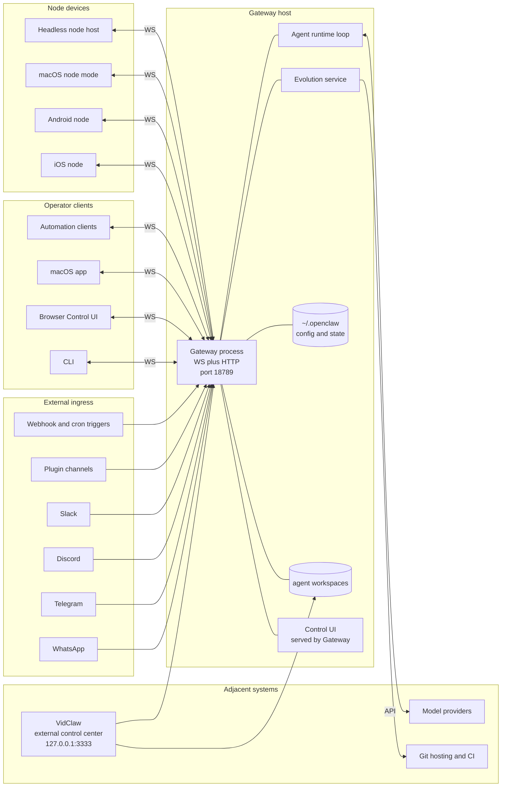
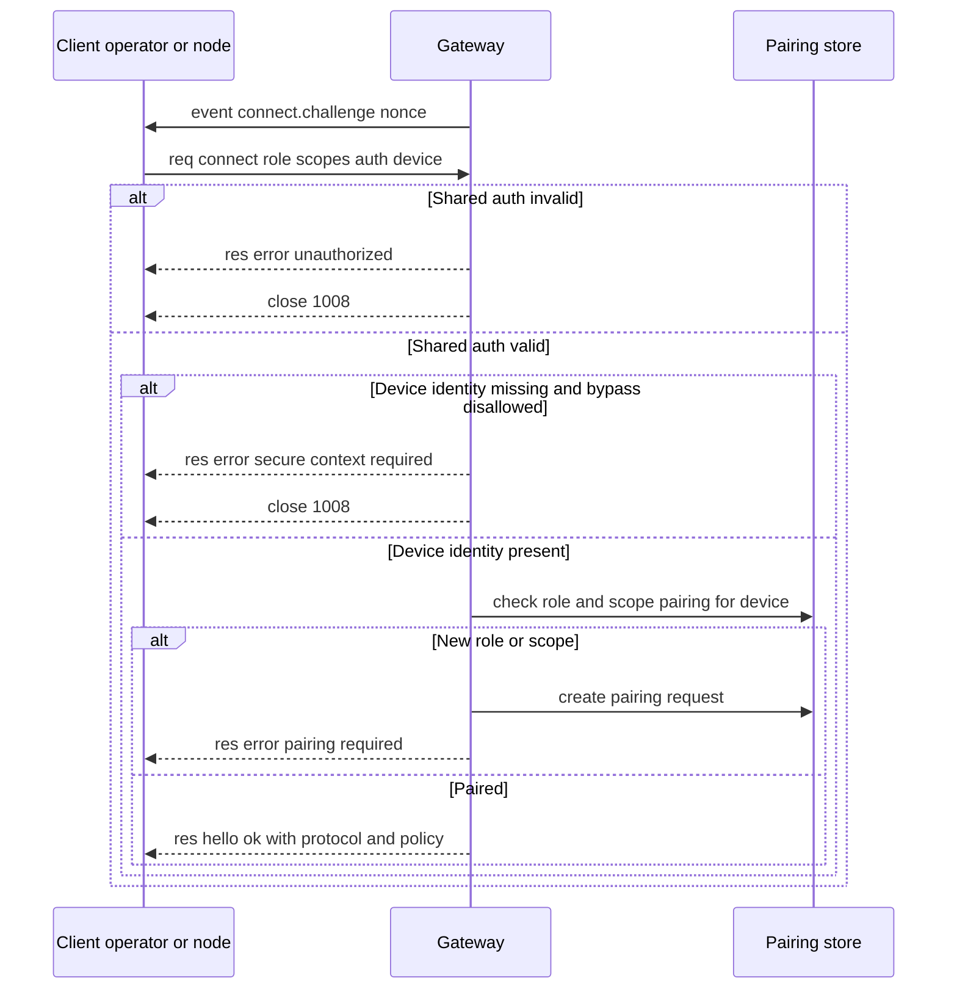
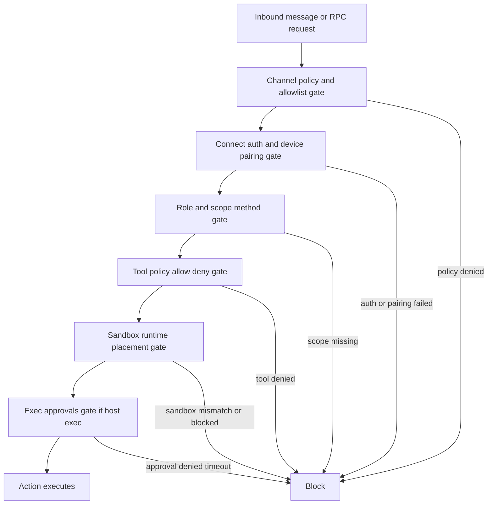
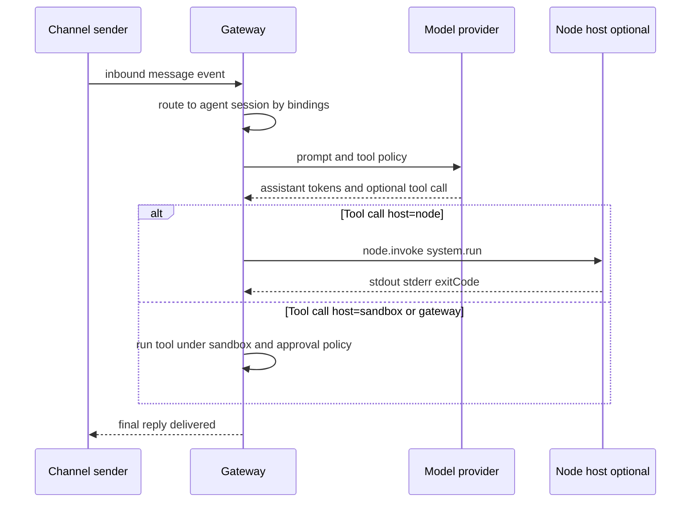
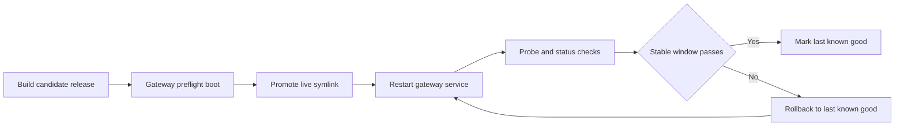
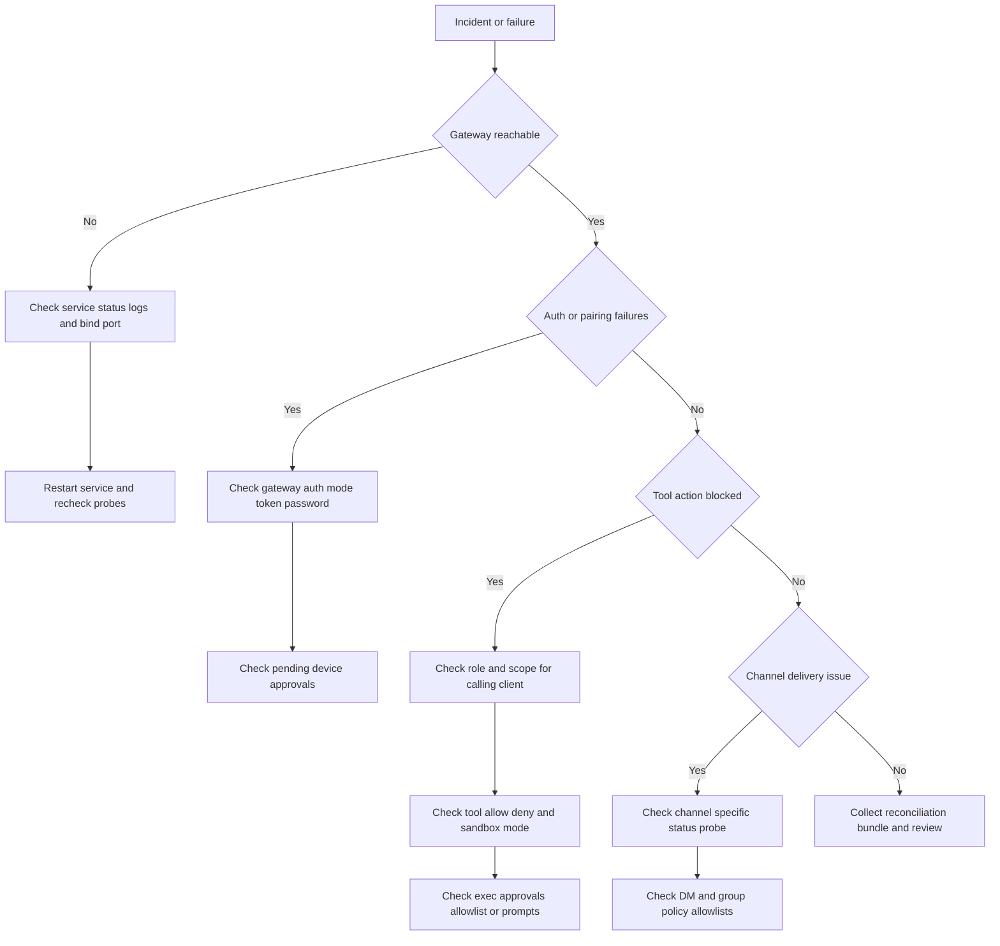

# System architecture

This is the canonical OpenClaw system atlas for operators and maintainers.
It combines architecture, access boundaries, operations, plugin fit, and runtime
reconciliation into one public safe document.

## Scope and intent

This atlas is optimized for:

- Deterministic operation of one Gateway as the control plane
- Clear trust boundaries for chat, tools, nodes, and admin surfaces
- Multi agent isolation for workspace, auth profiles, and session state
- Secure private access patterns for VPS and home servers
- Repeatable day 2 operations with probe and rollback workflows

This atlas is not optimized for:

- Public internet exposed admin surfaces
- One click PaaS only assumptions
- Implicit trust in sender content or plugin code
- Ad hoc operations without health gates

## Optimization goals

OpenClaw is primarily optimized for:

- Single Gateway ownership of channels and WebSocket control plane
- Fast operator control through Control UI, CLI, and nodes
- Safety by layered gates: channel policy, pairing, scopes, tool policy, sandbox, approvals
- Extensibility through in process plugins and external companion systems

OpenClaw intentionally accepts these tradeoffs:

- Plugins run in process and are trusted code
- Tool capable agents need explicit hardening to reduce blast radius
- High flexibility means misconfiguration can widen risk if guardrails are ignored

## A2 blueprint poster

Print asset path:

- [`docs/assets/architecture/system-atlas-a2.svg`](/assets/architecture/system-atlas-a2.svg)

Print guidance:

- Target: A2 landscape
- Theme: network blueprint
- Density: balanced
- Print at 100 percent scale for best label readability


## Full component topology


```mermaid
flowchart LR
  subgraph Ingress[External ingress]
    WA[WhatsApp]
    TG[Telegram]
    DS[Discord]
    SL[Slack]
    EXT[Plugin channels]
    HOOKS[Webhook and cron triggers]
  end

  subgraph Host[Gateway host]
    GW[Gateway process\nWS plus HTTP\nport 18789]
    AG[Agent runtime loop]
    EV[Evolution service]
    STATE[(~/.openclaw\nconfig and state)]
    WORK[(agent workspaces)]
    CUI[Control UI\nserved by Gateway]
    GW --- AG
    GW --- EV
    GW --- STATE
    GW --- WORK
    GW --- CUI
  end

  subgraph Operators[Operator clients]
    CLI[CLI]
    WEB[Browser Control UI]
    MAC[macOS app]
    AUTO[Automation clients]
  end

  subgraph Nodes[Node devices]
    IOS[iOS node]
    AND[Android node]
    MACNODE[macOS node mode]
    HEAD[Headless node host]
  end

  subgraph Adjacent[Adjacent systems]
    VID[VidClaw\nexternal control center\n127.0.0.1:3333]
    MODELS[Model providers]
    SCM[Git hosting and CI]
  end

  WA --> GW
  TG --> GW
  DS --> GW
  SL --> GW
  EXT --> GW
  HOOKS --> GW

  CLI <-- WS --> GW
  WEB <-- WS --> GW
  MAC <-- WS --> GW
  AUTO <-- WS --> GW

  IOS <-- WS --> GW
  AND <-- WS --> GW
  MACNODE <-- WS --> GW
  HEAD <-- WS --> GW

  AG <-- API --> MODELS
  EV --> SCM
  VID --> GW
  VID --> WORK
```

Caption: one Gateway host is the source of truth for channels, sessions, auth,
and control plane state. VidClaw is adjacent and external to the in process
plugin runtime.

## Runtime source of truth inventories

### Core channel inventory

Source: `src/channels/registry.ts`

<!-- atlas:auto:core-channels:start -->

| Channel id   | Label       | Docs path              | Source note                                                                 |
| ------------ | ----------- | ---------------------- | --------------------------------------------------------------------------- |
| `telegram`   | Telegram    | `/channels/telegram`   | simplest way to get started — register a bot with @BotFather and get going. |
| `whatsapp`   | WhatsApp    | `/channels/whatsapp`   | works with your own number; recommend a separate phone + eSIM.              |
| `discord`    | Discord     | `/channels/discord`    | very well supported right now.                                              |
| `irc`        | IRC         | `/channels/irc`        | classic IRC networks with DM/channel routing and pairing controls.          |
| `googlechat` | Google Chat | `/channels/googlechat` | Google Workspace Chat app with HTTP webhook.                                |
| `slack`      | Slack       | `/channels/slack`      | supported (Socket Mode).                                                    |
| `signal`     | Signal      | `/channels/signal`     | core built in channel                                                       |
| `imessage`   | iMessage    | `/channels/imessage`   | this is still a work in progress.                                           |

<!-- atlas:auto:core-channels:end -->

### Plugin channel inventory

Source: `extensions/*/package.json` `openclaw.channel`

<!-- atlas:auto:plugin-channels:start -->

| Channel id       | Label           | npm spec                   | Docs path                  | Extension directory         |
| ---------------- | --------------- | -------------------------- | -------------------------- | --------------------------- |
| `feishu`         | Feishu          | `@openclaw/feishu`         | `/channels/feishu`         | `extensions/feishu`         |
| `googlechat`     | Google Chat     | `@openclaw/googlechat`     | `/channels/googlechat`     | `extensions/googlechat`     |
| `nostr`          | Nostr           | `@openclaw/nostr`          | `/channels/nostr`          | `extensions/nostr`          |
| `msteams`        | Microsoft Teams | `@openclaw/msteams`        | `/channels/msteams`        | `extensions/msteams`        |
| `mattermost`     | Mattermost      | `@openclaw/mattermost`     | `/channels/mattermost`     | `extensions/mattermost`     |
| `nextcloud-talk` | Nextcloud Talk  | `@openclaw/nextcloud-talk` | `/channels/nextcloud-talk` | `extensions/nextcloud-talk` |
| `matrix`         | Matrix          | `@openclaw/matrix`         | `/channels/matrix`         | `extensions/matrix`         |
| `bluebubbles`    | BlueBubbles     | `@openclaw/bluebubbles`    | `/channels/bluebubbles`    | `extensions/bluebubbles`    |
| `line`           | LINE            | `@openclaw/line`           | `/channels/line`           | `extensions/line`           |
| `zalo`           | Zalo            | `@openclaw/zalo`           | `/channels/zalo`           | `extensions/zalo`           |
| `zalouser`       | Zalo Personal   | `@openclaw/zalouser`       | `/channels/zalouser`       | `extensions/zalouser`       |
| `tlon`           | Tlon            | `@openclaw/tlon`           | `/channels/tlon`           | `extensions/tlon`           |

<!-- atlas:auto:plugin-channels:end -->

## Access and trust boundaries

### Trust boundary map

- Boundary A: network edge to Gateway HTTP and WebSocket
- Boundary B: connect handshake, auth, device identity, pairing
- Boundary C: role and scope gates for Gateway methods and events
- Boundary D: tool policy and sandbox runtime placement
- Boundary E: exec approvals on gateway host or node host
- Boundary F: filesystem and credential storage under `~/.openclaw`

### Operator and node role model

- `role=operator`: control plane clients (CLI, Control UI, macOS app, automation)
- `role=node`: capability host (camera, canvas, location, system.run)

### Gateway method scope matrix

Source: `src/gateway/server-methods.ts`

<!-- atlas:auto:gateway-method-scopes:start -->

| Authorization gate  | Required role or scope                                  | Methods                                                                                                                                                                                                                                                                                                                                                                                                                                                                                                                                          |
| ------------------- | ------------------------------------------------------- | ------------------------------------------------------------------------------------------------------------------------------------------------------------------------------------------------------------------------------------------------------------------------------------------------------------------------------------------------------------------------------------------------------------------------------------------------------------------------------------------------------------------------------------------------ |
| Node role methods   | `role=node`                                             | `node.event`, `node.invoke.result`, `skills.bins`                                                                                                                                                                                                                                                                                                                                                                                                                                                                                                |
| Approval methods    | `operator.approvals` or `operator.admin`                | `exec.approval.list`, `exec.approval.request`, `exec.approval.resolve`, `exec.approval.waitDecision`                                                                                                                                                                                                                                                                                                                                                                                                                                             |
| Pairing methods     | `operator.pairing` or `operator.admin`                  | `device.pair.approve`, `device.pair.list`, `device.pair.reject`, `device.token.revoke`, `device.token.rotate`, `node.pair.approve`, `node.pair.list`, `node.pair.reject`, `node.pair.request`, `node.pair.verify`, `node.rename`                                                                                                                                                                                                                                                                                                                 |
| Read methods        | `operator.read` or `operator.write` or `operator.admin` | `agent.identity.get`, `agents.list`, `channels.status`, `chat.history`, `config.get`, `cron.list`, `cron.runs`, `cron.status`, `evolution.insights.list`, `evolution.proposals.list`, `evolution.sources.list`, `evolution.status`, `health`, `last-heartbeat`, `logs.tail`, `models.list`, `node.describe`, `node.list`, `office.layout.get`, `office.snapshot`, `sessions.list`, `sessions.preview`, `skills.status`, `status`, `system-presence`, `talk.config`, `tts.providers`, `tts.status`, `usage.cost`, `usage.status`, `voicewake.get` |
| Write methods       | `operator.write` or `operator.admin`                    | `agent`, `agent.wait`, `browser.request`, `chat.abort`, `chat.send`, `node.invoke`, `send`, `talk.mode`, `tts.convert`, `tts.disable`, `tts.enable`, `tts.setProvider`, `voicewake.set`, `wake`                                                                                                                                                                                                                                                                                                                                                  |
| Admin prefixes      | `operator.admin`                                        | `exec.approvals.`, `config.`, `update.`, `wizard.`                                                                                                                                                                                                                                                                                                                                                                                                                                                                                               |
| Admin exact methods | `operator.admin`                                        | `agents.create`, `agents.delete`, `agents.update`, `channels.logout`, `cron.add`, `cron.remove`, `cron.run`, `cron.update`, `sessions.compact`, `sessions.delete`, `sessions.patch`, `sessions.reset`, `skills.install`, `skills.update`                                                                                                                                                                                                                                                                                                         |

<!-- atlas:auto:gateway-method-scopes:end -->

### Event visibility scope guards

Source: `src/gateway/server-broadcast.ts`

<!-- atlas:auto:event-scope-guards:start -->

| Event                     | Required scope       |
| ------------------------- | -------------------- |
| `device.pair.requested`   | `operator.pairing`   |
| `device.pair.resolved`    | `operator.pairing`   |
| `exec.approval.requested` | `operator.approvals` |
| `exec.approval.resolved`  | `operator.approvals` |
| `node.pair.requested`     | `operator.pairing`   |
| `node.pair.resolved`      | `operator.pairing`   |

<!-- atlas:auto:event-scope-guards:end -->

### Connect and pairing guards

Source: `src/gateway/server/ws-connection/message-handler.ts`

<!-- atlas:auto:connect-guards:start -->

| Connect guard                                    | Current behavior in source                           |
| ------------------------------------------------ | ---------------------------------------------------- |
| Allowed roles                                    | `operator`, `node`                                   |
| Scope model                                      | Explicit scopes only default deny                    |
| Scope stripping without device identity          | enabled                                              |
| Control UI secure context requirement            | HTTPS or localhost required unless bypass is enabled |
| allowInsecureAuth toggle in handshake            | present                                              |
| dangerouslyDisableDeviceAuth toggle in handshake | present                                              |

<!-- atlas:auto:connect-guards:end -->

### Connect handshake and pairing flow


```mermaid
sequenceDiagram
  participant C as Client operator or node
  participant G as Gateway
  participant P as Pairing store

  G->>C: event connect.challenge nonce
  C->>G: req connect role scopes auth device

  alt Shared auth invalid
    G-->>C: res error unauthorized
    G-->>C: close 1008
  else Shared auth valid
    alt Device identity missing and bypass disallowed
      G-->>C: res error secure context required
      G-->>C: close 1008
    else Device identity present
      G->>P: check role and scope pairing for device
      alt New role or scope
        G->>P: create pairing request
        G-->>C: res error pairing required
      else Paired
        G-->>C: res hello ok with protocol and policy
      end
    end
  end
```

Caption: pairing approvals gate role and scope upgrades. Shared auth alone is not
a substitute for remote device identity when pairing is required.

### Permission gate pipeline


```mermaid
flowchart TD
  M[Inbound message or RPC request]
  A[Channel policy and allowlist gate]
  B[Connect auth and device pairing gate]
  C[Role and scope method gate]
  D[Tool policy allow deny gate]
  E[Sandbox runtime placement gate]
  F[Exec approvals gate if host exec]
  G[Action executes]

  M --> A --> B --> C --> D --> E --> F --> G

  X1[Block]
  A -->|policy denied| X1
  B -->|auth or pairing failed| X1
  C -->|scope missing| X1
  D -->|tool denied| X1
  E -->|sandbox mismatch or blocked| X1
  F -->|approval denied timeout| X1
```

Caption: security is layered. no single gate should carry the full safety burden.

## End to end message to action sequence


```mermaid
sequenceDiagram
  participant Chat as Channel sender
  participant GW as Gateway
  participant Model as Model provider
  participant Node as Node host optional

  Chat->>GW: inbound message event
  GW->>GW: route to agent session by bindings
  GW->>Model: prompt and tool policy
  Model-->>GW: assistant tokens and optional tool call

  alt Tool call host=node
    GW->>Node: node.invoke system.run
    Node-->>GW: stdout stderr exitCode
  else Tool call host=sandbox or gateway
    GW->>GW: run tool under sandbox and approval policy
  end

  GW-->>Chat: final reply delivered
```

Caption: delivery and tooling pass through the same routed agent session and
policy chain.

## Agent isolation model

An agent is an isolation domain with these boundaries:

- Workspace path (default cwd, not hard sandbox by itself)
- Agent state directory (`agentDir`) and auth profiles
- Session store and transcript files
- Agent specific tool policy and optional sandbox policy

Isolation sources:

- Per agent auth profile path: `~/.openclaw/agents/<agentId>/agent/auth-profiles.json`
- Per agent sessions path: `~/.openclaw/agents/<agentId>/sessions/`
- Per agent workspace path via config (`agents.list[].workspace`)

Isolation caveats:

- Workspace path is a default cwd, not a host filesystem jail
- Without sandboxing, absolute paths can reach host files
- Agent to agent actions require explicit allow config

Recommended split for hardened VPS setups:

- `main`: chat and routing, minimal tools, no host exec
- `coder`: sandboxed filesystem and exec workflow tools
- `power`: explicit approvals for high risk tools
- `ops`: maintenance only, usually disabled or tightly constrained

## Channel and plugin architecture

Channel architecture has two layers:

- Core channel registry (`src/channels/registry.ts`)
- Plugin channel metadata and implementations (`extensions/*`)

Plugin architecture facts:

- Plugins are loaded in process with the Gateway
- Plugins can register tools, RPC methods, HTTP routes, services, hooks
- Plugin config is schema validated through plugin manifest metadata

VidClaw clarification:

- VidClaw is an external self hosted control center
- VidClaw is not an in process OpenClaw plugin
- VidClaw typically runs beside Gateway on `127.0.0.1:3333`

Related docs:

- [Plugins](/tools/plugin)
- [VidClaw](/tools/vidclaw)
- [Work plugin](/plugins/work)
- [Voice call plugin](/plugins/voice-call)

## UI and portal address matrix

| Surface                   | Default local address                               | Access class    | Notes                                               |
| ------------------------- | --------------------------------------------------- | --------------- | --------------------------------------------------- |
| Gateway Control UI        | `http://127.0.0.1:18789/`                           | admin           | Served by Gateway, WebSocket auth and pairing aware |
| Gateway WebSocket         | `ws://127.0.0.1:18789`                              | control plane   | Operator and node transport                         |
| VidClaw UI                | `http://127.0.0.1:3333/`                            | admin           | External control center, keep loopback only         |
| Remote Control UI via SSH | `ssh -N -L 18789:127.0.0.1:18789 user@gateway-host` | private tunnel  | Recommended universal fallback                      |
| Remote VidClaw via SSH    | `ssh -N -L 3333:127.0.0.1:3333 user@gateway-host`   | private tunnel  | Keep VidClaw off public internet                    |
| Tailscale Serve UI        | `https://<magicdns>/`                               | private network | Recommended remote UX for Control UI                |

## VPS operating model

### VPS baseline defaults from source

Source: `ops/vps/openclaw.vps-coding.json5`

<!-- atlas:auto:vps-defaults:start -->

| VPS baseline field           | Value from `ops/vps/openclaw.vps-coding.json5`                 |
| ---------------------------- | -------------------------------------------------------------- |
| Gateway bind                 | `loopback`                                                     |
| Gateway port                 | `18789`                                                        |
| Gateway auth mode            | `token`                                                        |
| Gateway tool deny list       | `gateway`, `sessions_send`, `sessions_spawn`, `whatsapp_login` |
| Telegram dmPolicy            | `allowlist`                                                    |
| Telegram groupPolicy         | `disabled`                                                     |
| Telegram configWrites        | `false`                                                        |
| Telegram streamMode          | `off`                                                          |
| Session dmScope              | `per-channel-peer`                                             |
| Agent ids                    | `main`, `coder`, `power`, `ops`                                |
| Work plugin enabled          | `true`                                                         |
| Work plugin coderSessionKey  | `agent:coder:main`                                             |
| Exec approvals enabled       | `true`                                                         |
| Exec approvals mode          | `targets`                                                      |
| Exec approvals agentFilter   | `power`                                                        |
| Exec approvals targets count | `1`                                                            |
| tools.elevated.enabled       | `false`                                                        |

<!-- atlas:auto:vps-defaults:end -->

### Deploy health rollback loop

1. Build candidate release in isolated release directory
2. Preflight a real gateway boot on loopback test port
3. Promote symlink to candidate release
4. Restart service and run `openclaw channels status --probe`
5. Hold stability window and verify restart count stays stable
6. Mark as last known good release

Rollback path:

1. Pause auto update timer
2. Repoint symlink to last known good release
3. Restart and probe again
4. Resume update timer only after fix deployment

### Operations loop diagram


```mermaid
flowchart LR
  A[Build candidate release] --> B[Gateway preflight boot]
  B --> C[Promote live symlink]
  C --> D[Restart gateway service]
  D --> E[Probe and status checks]
  E --> F{Stable window passes}
  F -->|Yes| G[Mark last known good]
  F -->|No| H[Rollback to last known good]
  H --> D
```

Caption: release safety depends on preflight plus post restart probes and a
stability window.

## Best practices and anti patterns

### Best practices

- Keep gateway bind loopback unless explicit remote bind is required
- Enforce gateway auth and keep strong token or password hygiene
- Use pairing approvals for remote operator and node devices
- Keep chat facing agents minimal and route risky work to dedicated agents
- Use sandboxing for coding and filesystem mutation workflows
- Keep VidClaw private with loopback plus SSH or tailnet access
- Run `openclaw security audit --deep` after config changes
- Prefer exact plugin versions and explicit plugin allow lists
- Verify with `openclaw status --all` and `openclaw status --deep`

### Anti patterns

- Publicly exposing Control UI or VidClaw without private network controls
- Running tool rich agents in open group or open DM policies
- Sharing one high privilege agent across unrelated operators
- Treating workspace path as strong isolation without sandbox
- Installing plugins from untrusted sources without review
- Shipping updates without boot preflight and post restart probe

## Incident and troubleshooting decision tree


```mermaid
flowchart TD
  S[Incident or failure] --> N{Gateway reachable}
  N -->|No| N1[Check service status logs and bind port]
  N1 --> N2[Restart service and recheck probes]

  N -->|Yes| A{Auth or pairing failures}
  A -->|Yes| A1[Check gateway auth mode token password]
  A1 --> A2[Check pending device approvals]

  A -->|No| T{Tool action blocked}
  T -->|Yes| T1[Check role and scope for calling client]
  T1 --> T2[Check tool allow deny and sandbox mode]
  T2 --> T3[Check exec approvals allowlist or prompts]

  T -->|No| C{Channel delivery issue}
  C -->|Yes| C1[Check channel specific status probe]
  C1 --> C2[Check DM and group policy allowlists]

  C -->|No| R[Collect reconciliation bundle and review]
```

Caption: diagnose from transport and auth first, then method scopes and tool
policy, then channel specific delivery paths.

## Live runtime reconciliation workflow

This section is for operator supplied runtime evidence. Keep all output public
safe before sharing.

### Redaction rules

Before sharing command output:

- Remove tokens, passwords, API keys, cookies, and auth headers
- Replace hostnames, IP addresses, usernames, phone numbers with placeholders
- Keep structure and key fields unchanged so reconciliation stays deterministic

### Checklist commands

Run on the gateway host, then share output grouped exactly by heading.

#### host_runtime_fingerprint

```bash
uname -a
node -v
openclaw --version
pwd
```

#### listening_ports_exposure

```bash
ss -ltnp | rg '18789|3333|22' || true
openclaw config get gateway.bind
openclaw config get gateway.port
```

#### gateway_health_status_probe

```bash
openclaw health
openclaw status --all
openclaw status --deep
openclaw channels status --probe
```

#### security_audit

```bash
openclaw security audit
openclaw security audit --deep
```

#### inventory_agents_bindings_plugins_nodes_devices

```bash
openclaw agents list --bindings
openclaw plugins list
openclaw nodes status
openclaw devices list
```

### Ingestion format for reconciliation

Use this exact template when sharing output:

```text
[host_runtime_fingerprint]
<redacted command output>

[listening_ports_exposure]
<redacted command output>

[gateway_health_status_probe]
<redacted command output>

[security_audit]
<redacted command output>

[inventory_agents_bindings_plugins_nodes_devices]
<redacted command output>
```

After you share the bundle, this atlas can be reconciled by updating runtime
annotation sections without changing the architecture structure.

## Related docs

- [Gateway architecture](/concepts/architecture)
- [Gateway protocol](/gateway/protocol)
- [Security](/gateway/security)
- [Remote access](/gateway/remote)
- [Sandboxing](/gateway/sandboxing)
- [Exec approvals](/tools/exec-approvals)
- [Multi agent routing](/concepts/multi-agent)
- [Nodes](/nodes)
- [VPS coding automation](/install/vps-coding)
- [VidClaw](/tools/vidclaw)
